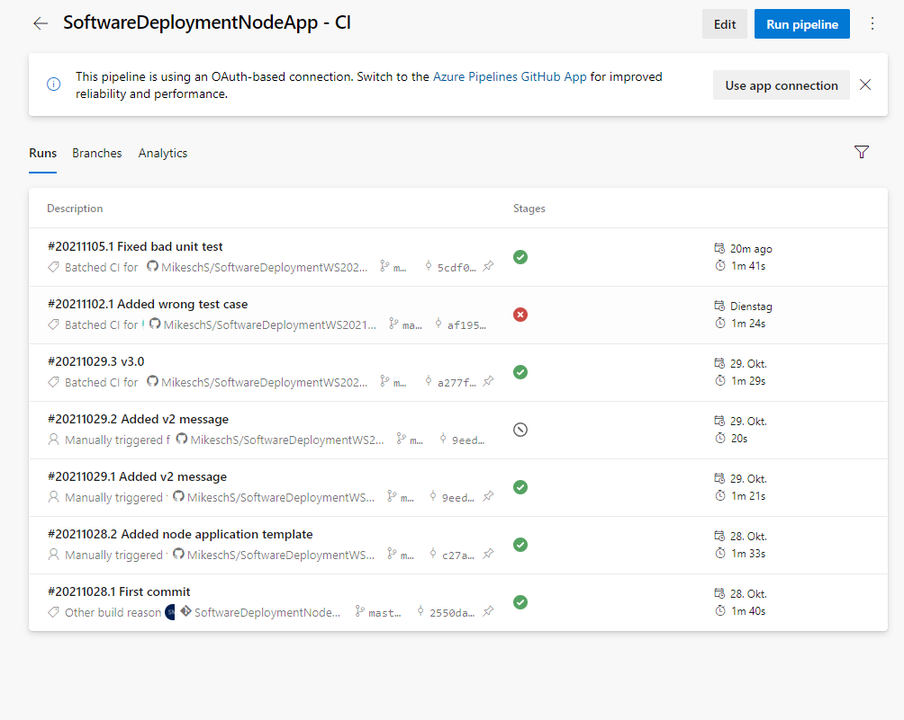

Staging: https://softwaredeploymentnodeapp.azurewebsites.net/
Production: https://softwaredeploymentnodeapprelease.azurewebsites.net/

Um einen Production Release zu deployen, muss auf Azure DevOps Pipelines > Releases > "eigener Production Release" der gewünschte Release ausgewählt werden und der Button "Deploy" gedrückt werden.

Pipeline-Runs

Pipeline-Tasks

Staging Pipeline

Release Tasks

Release pipeline

