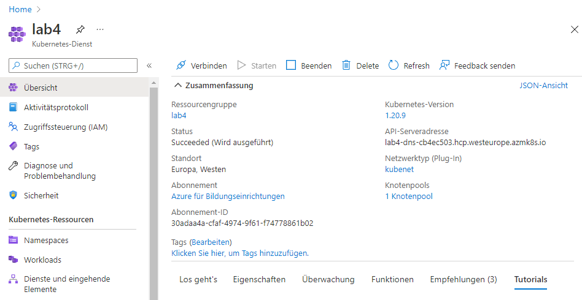
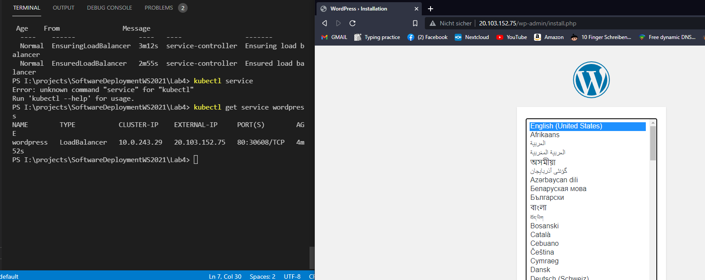

# Lab 4

## Prerequesites
You need to have an azure kubernetes cluster up and running.



You need to have installed kubectl and have an config file for your AKS cluster. The config can be downloaded by 
```
az aks get-credentials -g <RessourceGroupName> -n <ClusterName>
```
You know it worked by executing (as an example)
```
kubectl get nodes
```

## Files

### kustomization.yaml
This file contains a secretGenerator - a definition of kubernetes secret ressources to create when deploying (should not be in version control as passwords are in cleartext)
Furthermore, it contains the references to the yaml files which should be deployment when deploying this yaml file.

### wordpress-deployment.yaml && mysql-deployment.yaml
#### LoadBalancer-Service
This defines the Service which points to the wordpress installation. As this is a LoadBalancer Service it results in an external IP, where the defined deployment is reachable.

#### ClusterIP-Service
This defines the Service which points to the mysql-database. As this is a ClusterIP Service it is only reachable from within the cluster - therefore not reachable from any outside client.

#### PersistentVolumeClaim
This is the volume claim for the www-data files of the wordpress and mysql install.

#### Deployment
This is the definition of:
* which image
* which ports should be opened
* environment variables and where to get them
* where to mount the persistent volume claim
* several labels and selectors for referencing to the pods and the deployment itself (from other ressources)

## How to run
Direct your commandline into the Lab4 directory and execute
```
kubectl apply -k ./
```

By executing 
```
kubectl get services wordpress
```
you get the external IP-Address of the wordpress-Service. This IP-Address can be entered into the web-browser. The Wordpress installation should now appear.

